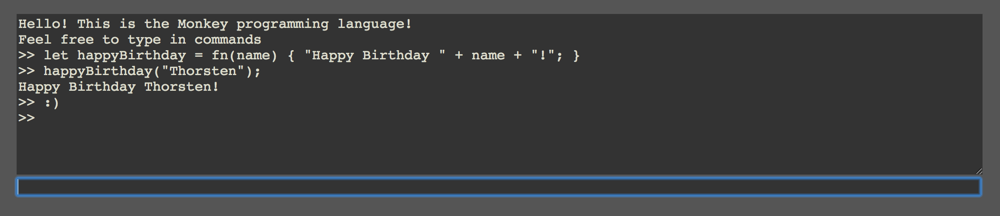

# monkey-shell
A simple shell web component for the Monkey 🐒 language

A shell web component for the Monkey programming language as known from the book [Writing an Interpreter in Go](https://interpreterbook.com/), written in [Dart](https://www.dartlang.org/).

Based on the [monkey-dart](https://github.com/mreichelt/monkey-dart/) source code.

Try it out yourself: https://marcreichelt.de/monkey-shell/
